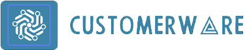

<a name="readme-top"></a>

<div align="center">
  <!-- You are encouraged to replace this logo with your own! Otherwise you can also remove it. -->
  
  <br/>

  <h3><b>Customerware model</b></h3>

</div>

<!-- TABLE OF CONTENTS -->

# 📗 Table of Contents

- [📖 About the Project](#about-project)
  - [🛠 Built With](#built-with)
    - [Tech Stack](#tech-stack)
    - [Key Features](#key-features)
  - [🚀 Live Demo](#live-demo)
- [💻 Getting Started](#getting-started)
  - [Setup](#setup)
  - [Prerequisites](#prerequisites)
  - [Install](#install)
  - [Deployment](#deployment)
- [👥 Authors](#authors)
- [🔭 Future Features](#future-features)
- [🤝 Contributing](#contributing)
- [⭐️ Show your support](#support)
- [🙏 Acknowledgements](#acknowledgements)
- [❓ FAQ](#faq)
-

<!-- PROJECT DESCRIPTION -->

# 📖 [Customerware] <a name="about-project"></a>

**[customerware]** is a model that predicts whether customers will leave a company or not and more specifically in the telecommunication industry

- [Video Link](https://drive.google.com/file/d/1s7rLOqwemTrCtGrABLowhAAFGpJPFGK7/view?usp=sharing)
- [Deployed Model](https://customerware-frontend.vercel.app/)
- [Backend Repositiory](https://github.com/Ednah-Akoth/AI_flask)
- [Frontend Repository](https://github.com/Samuelwanza/customerware-frontend)
- [Colab Link](https://colab.research.google.com/drive/16evrAEfLrcTJqvEa7UDdjVt0FfGr1zm5#scrollTo=cReGnLWuHhQr)

## 🛠 Built With <a name="built-with"></a>

### Tech Stack <a name="tech-stack"></a>

<details>
  <summary>Model</summary>
  <p>
    For the model we mainly used Jupyter notebook for dataset cleaning, feature engineering, feature selection and model traning,validation, valuation and sample deployment.
    Tools:pandas,matplotlib,scitlearn,xgboost,numpy,seaborn
  
  </p>
</details>

<details>
  <summary>Client</summary>
  <p>
  The frontend is implemented in HML,CSS and Vanilla Javascript
  </p>
</details>

<details>
  <summary>Server</summary>
  <p>
    The server is implemented in flask with scitlearn, pandas,joblib,flask-cors as dependencies
  </p>
</details>

<!-- Features -->

### Key Features <a name="key-features"></a>

- **[Prediction]**
- **[GoodUI]**
- **[ReliableOutput]**

<p align="right">(<a href="#readme-top">back to top</a>)</p>

<!-- LIVE DEMO -->

## 🚀 Live Demo <a name="live-demo"></a>

- [Live Demo Link](https://drive.google.com/file/d/1s7rLOqwemTrCtGrABLowhAAFGpJPFGK7/view?usp=sharing)

<p align="right">(<a href="#readme-top">back to top</a>)</p>

<!-- GETTING STARTED -->

## 💻 Getting Started <a name="getting-started"></a>

To get a local copy up and running, follow these steps.

### Prerequisites

In order to run this project you need:

- A google account in order to run colab
- scit-learn, flask-cors,Flask, xgboost for the server
- You should have python installed

```sh
sudo apt-get update
sudo apt-get install python3.6

```

-->

Clone this repository to your desired folder:

Example commands:

```sh
  cd my-folder
  git clone git@github.com:myaccount/customerware-submission.git.git
```

### Install

- To run colab use the link:[colab link](https://colab.research.google.com/drive/16evrAEfLrcTJqvEa7UDdjVt0FfGr1zm5#scrollTo=cReGnLWuHhQr)

- To run the [frontend] head to this repository: [customerware frontend](https://github.com/Samuelwanza/customerware-frontend) and clone to choice directory,

```sh
  cd choice directory
  code .
```

click Go Live if live server is installed

- To run [server] head to the repository:[customerware](https://github.com/Ednah-Akoth/AI_flask) and clone it to choice directory

```sh
 cd choice directory
 git clone https://github.com/Ednah-Akoth/AI_flask
```

```sh
  pip install scit-learn, flask-cors,Flask, xgboost
```

```sh
  python main.py
```

### Deployment

You can deploy this project using:
-streamlit
-vercel
-railwayapp

<p align="right">(<a href="#readme-top">back to top</a>)</p>

<!-- AUTHORS -->

## 👥 Authors <a name="authors"></a>

👤 **Samuel Wanza**

- GitHub: [@githubhandle](https://github.com/Samuelwanza/)
- Twitter: [@twitterhandle](https://twitter.com/samuelmunguti9/)
- LinkedIn: [LinkedIn](https://www.linkedin.com/in/samuel-munguti-8a257a1bb/)

👤 **Ednah Akoth**

- GitHub: [@githubhandle](https://github.com/ednah-akoth)
- Twitter: [@twitterhandle](https://twitter.com/edmucious)
- LinkedIn: [LinkedIn](https://www.linkedin.com/in/ednah-akoth-7515a0207/)

👤 **Myra Lugwiri**

- GitHub: [@githubhandle](https://github.com/myralugwiri)
- Twitter: [@twitterhandle](https://twitter.com/ed)
- LinkedIn: [LinkedIn](https://www.linkedin.com/in/ednah-akoth-7515a0207/)

👤 **Spencer Kamayo**

- GitHub: [@githubhandle](https://github.com/kamayo-spencer)
- LinkedIn: [LinkedIn](https://www.linkedin.com/in/spencer-kamayo-1baa49217/)

👤 **Ahmed Mohamed**

- GitHub: [@githubhandle](https://github.com/Ahmed-ALU/)
- LinkedIn: [LinkedIn](https://www.linkedin.com/in/ahmedalu/)

<p align="right">(<a href="#readme-top">back to top</a>)</p>

<!-- CONTRIBUTING -->

## 🤝 Contributing <a name="contributing"></a>

Contributions, issues, and feature requests are welcome!

<p align="right">(<a href="#readme-top">back to top</a>)</p>

<!-- SUPPORT -->

## ⭐️ Show your support <a name="support"></a>

If you like this project kindly star it

<p align="right">(<a href="#readme-top">back to top</a>)</p>

<!-- ACKNOWLEDGEMENTS -->

## 🙏 Acknowledgments <a name="acknowledgements"></a>

> We would like to appreciate everyone that shared their ideas to the success of this project

<p align="right">(<a href="#readme-top">back to top</a>)</p>

<!-- FAQ (optional) -->

## ❓ FAQ <a name="faq"></a>

- **[In Which industry is this model valid]**

  - [The telecommunications industry given the dataset used]

<p align="right">(<a href="#readme-top">back to top</a>)</p>

<p align="right">(<a href="#readme-top">back to top</a>)</p>
